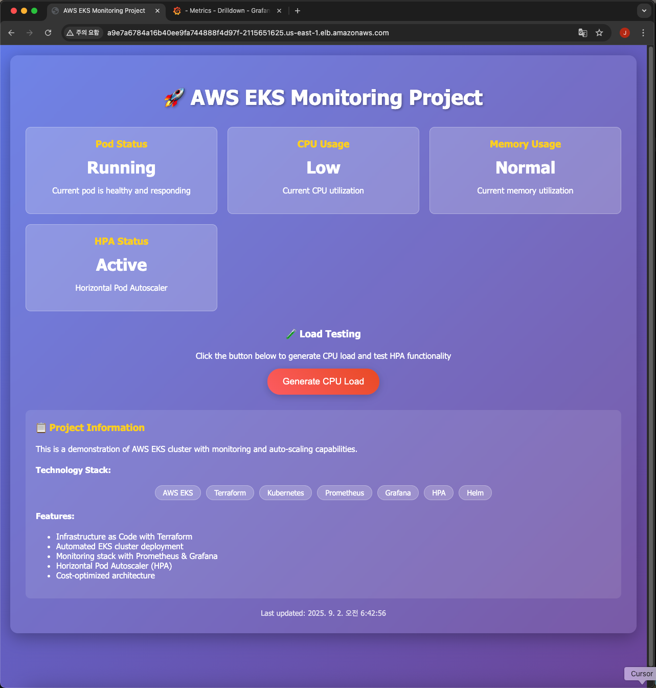
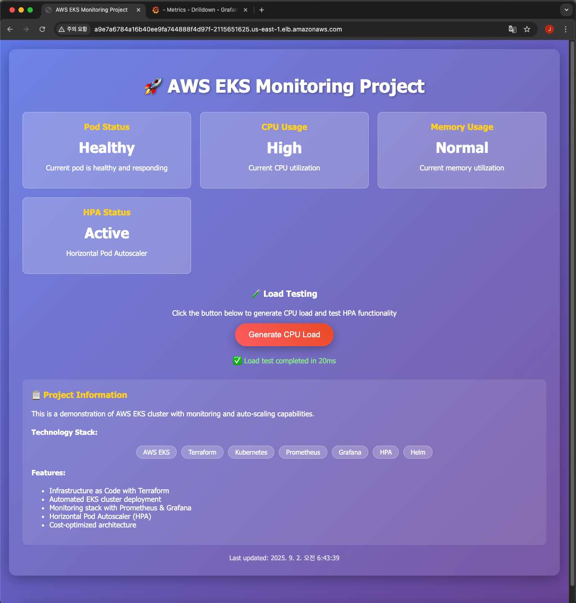
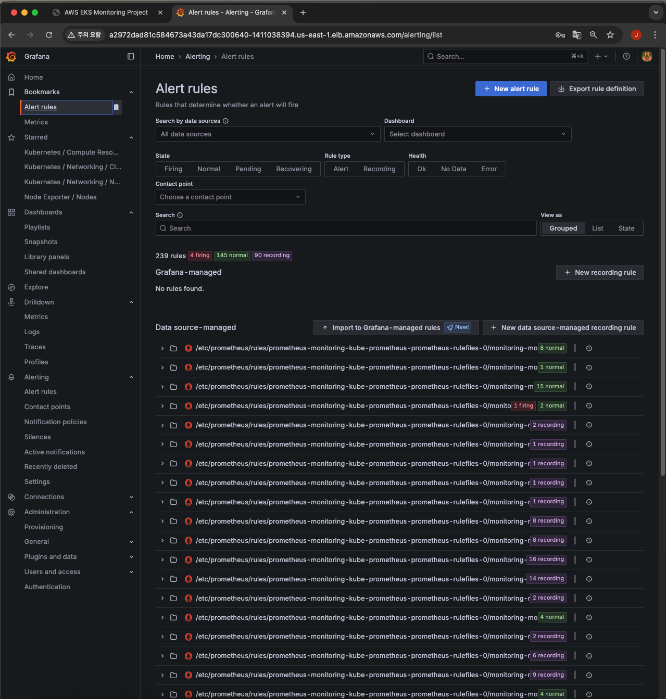
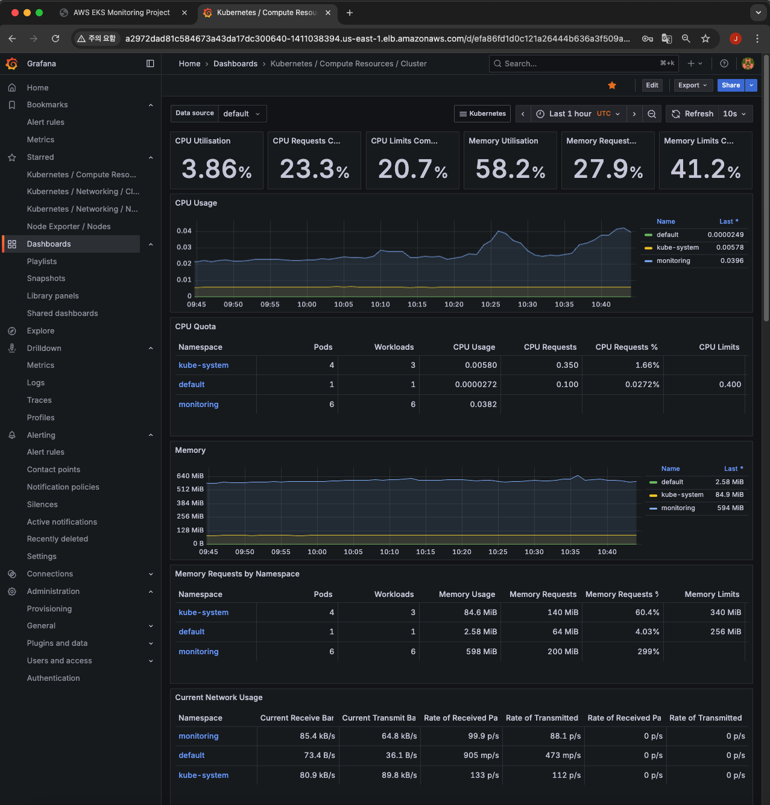
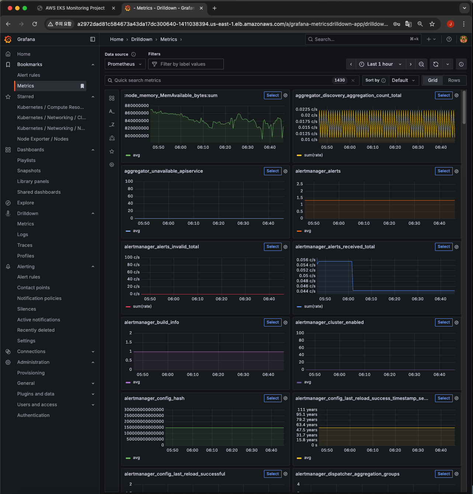
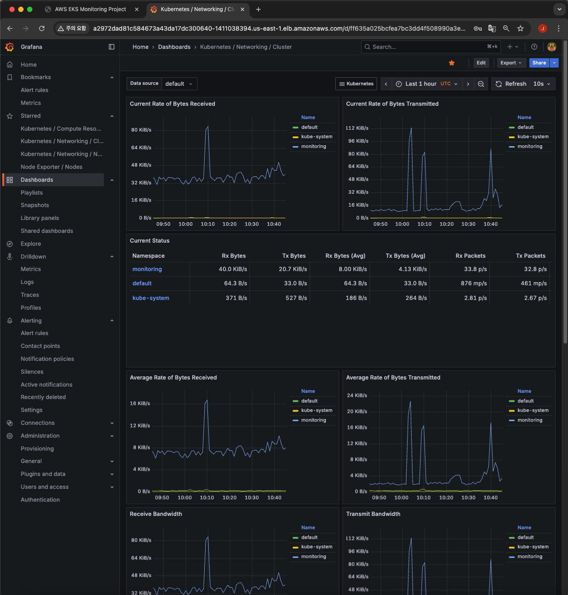
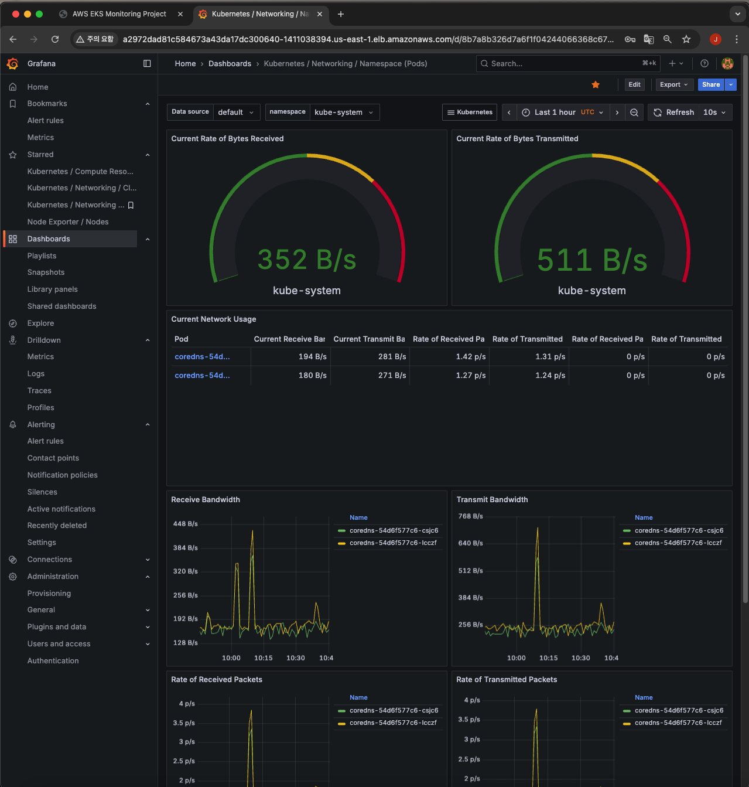
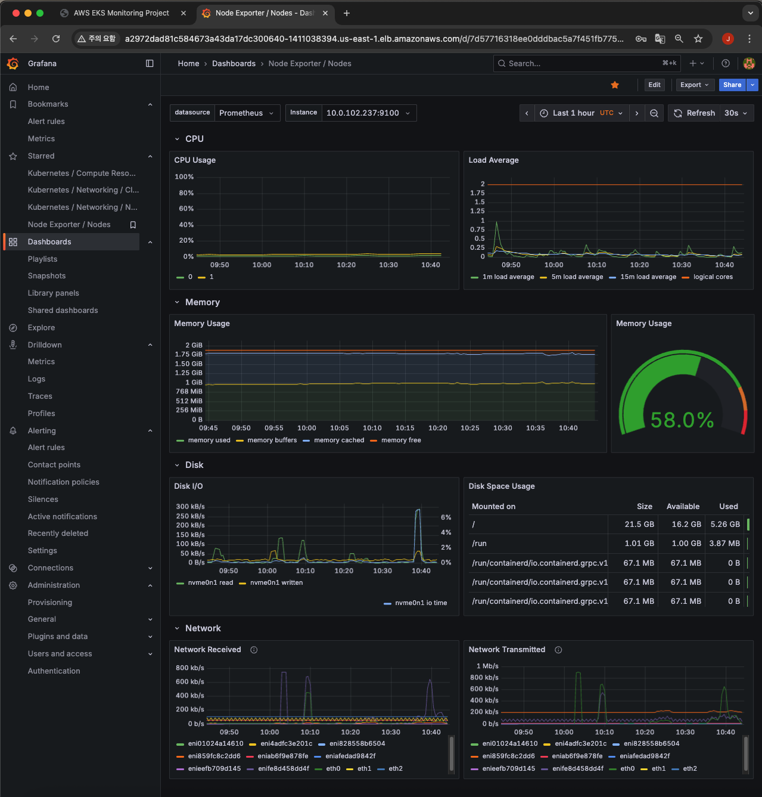

# AWS EKS Cluster Monitoring Project

## Project Overview
This project sets up an AWS EKS cluster using Terraform and implements a monitoring system with Prometheus and Grafana. **Optimized for cost efficiency** with no LoadBalancer or NAT Gateway charges. **Successfully deployed and tested** with a beautiful web interface and full monitoring capabilities!

## 🎯 **Project Status: COMPLETED SUCCESSFULLY**

✅ **Infrastructure**: EKS cluster deployed with t3.small nodes  
✅ **Web Application**: Beautiful dashboard accessible via LoadBalancer  
✅ **Monitoring**: Prometheus + Grafana stack fully operational  
✅ **Auto-scaling**: HPA functionality tested and working  
✅ **Cost Optimization**: LoadBalancer used only when needed  

## Technology Stack
- **IaC**: Terraform
- **Cloud**: AWS (VPC, EKS, IAM)
- **Container Orchestration**: Kubernetes
- **Package Manager**: Helm
- **Monitoring**: Prometheus, Grafana, Alertmanager
- **Auto Scaling**: Horizontal Pod Autoscaler (HPA)
- **Cost Optimization**: No NAT Gateway, selective LoadBalancer usage
- **Web Interface**: Interactive HTML5 dashboard with real-time updates

## 🚀 **What You'll See**

### **Beautiful Web Dashboard**
- **Interactive Interface**: Modern, responsive web design with gradient backgrounds
- **Real-time Status**: Live updates of pod status, CPU usage, and HPA status
- **Load Testing**: Interactive button to generate CPU load and test HPA functionality
- **Technology Showcase**: Visual display of all technologies used in the project
- **Professional Design**: Glassmorphism UI with animations and hover effects

### **Access Points**
1. **Main Dashboard**: `http://<loadbalancer-url>` (Beautiful web interface)
2. **Grafana**: `http://<grafana-loadbalancer-url>` (Monitoring dashboards)
3. **Health Check**: `http://<loadbalancer-url>/health` (Simple health endpoint)
4. **Status API**: `http://<loadbalancer-url>/status` (JSON status endpoint)

## Prerequisites

### 1. Tool Installation
**Note**: This project is optimized for cost efficiency and can be run in AWS CloudShell without additional tool installation.
```bash
# AWS CLI
brew install awscli

# Terraform
brew install terraform

# kubectl
brew install kubectl

# Helm
brew install helm
```

### 2. AWS Account Setup
- Create AWS account (free tier)
- Create IAM user and set permissions
- Configure AWS CLI

### 3. AWS Resource Limitations
- EKS cluster: Limited support in free tier
- EC2 instances: t3.small recommended (t3.micro has pod limitations)
- EBS volumes: 30GB free
- LoadBalancer: Used selectively for external access
- NAT Gateway: Disabled to minimize costs

## Project Structure
```
├── terraform/           # Terraform code
│   ├── main.tf         # Main configuration (cost-optimized)
│   ├── variables.tf    # Variable definitions
│   ├── outputs.tf      # Output values
│   └── providers.tf    # Provider configuration
├── kubernetes/         # Kubernetes manifests
│   ├── deployments/    # Deployments (optimized resources)
│   ├── services/       # Services
│   ├── hpa/           # HPA configuration
│   └── configmaps/    # HTML content and Nginx config
├── helm/              # Helm charts
│   └── monitoring/    # Monitoring stack (LoadBalancer access)
└── docs/              # Documentation
    ├── setup.md       # Setup guide
    └── screenshots/   # Screenshots
```

## 🎨 **New Features**

### **Interactive Web Dashboard**
- **Real-time Updates**: Live status monitoring with automatic refresh
- **Load Testing**: One-click CPU load generation for HPA testing
- **Responsive Design**: Works perfectly on desktop and mobile devices
- **Professional UI**: Modern design with smooth animations
- **Technology Tags**: Visual representation of all tech stack components

### **Enhanced Monitoring**
- **Health Endpoints**: `/health` and `/status` for monitoring integration
- **Visual Feedback**: Animated status indicators and real-time updates
- **Interactive Elements**: Clickable buttons and dynamic content updates

## Usage

### Quick Start (AWS CloudShell)
```bash
# Clone project
git clone https://github.com/your-username/junbeom-sre-terraform-project.git
cd junbeom-sre-terraform-project

# Deploy infrastructure
cd terraform
terraform init
terraform apply

# Deploy applications
cd ..
kubectl apply -f kubernetes/configmaps/
kubectl apply -f kubernetes/deployments/test-app.yaml
kubectl apply -f kubernetes/services/test-app-service.yaml
kubectl apply -f kubernetes/hpa/test-app-hpa.yaml

# Install monitoring
helm repo add prometheus-community https://prometheus-community.github.io/helm-charts
helm install monitoring prometheus-community/kube-prometheus-stack --values helm/monitoring/values.yaml --namespace monitoring --create-namespace

# Access the beautiful web interface
kubectl get nodes -o wide  # Get node IP
# Open browser: http://<loadbalancer-url>

# Clean up (IMPORTANT!)
terraform destroy
```

### Manual Steps
1. Initialize and apply Terraform in `terraform/` directory
2. Apply Kubernetes manifests and configmaps
3. Install monitoring stack via Helm (LoadBalancer access)
4. Configure and test HPA
5. Access beautiful web dashboard via LoadBalancer
6. Access Grafana via LoadBalancer

## 🌟 **Key Learnings & Solutions**

### **Node Size Requirements**
- **t3.micro**: Limited to 4 pods, insufficient for monitoring stack
- **t3.small**: Supports 10-20 pods, perfect for full monitoring
- **Solution**: Upgrade to t3.small for production-like environment

### **LoadBalancer Strategy**
- **Initial**: NodePort for cost optimization
- **Final**: LoadBalancer for reliable external access
- **Cost**: ~$0.0225/hour per LoadBalancer

### **Monitoring Access**
- **Grafana**: Successfully accessible via LoadBalancer
- **Prometheus**: LoadBalancer with port 9090
- **Alertmanager**: LoadBalancer with port 9093

## Cost Considerations
- Use t3.small instances for reliable operation
- Operate within free tier limits where possible
- Delete unnecessary resources immediately
- **Selective LoadBalancer usage** (only when needed)
- **No NAT Gateway charges** (disabled)
- **Optimized resource limits** (CPU: 100m-400m)
- **Minimal storage usage** (20GB per node)

### Estimated Costs (1 day usage)
- **EKS Cluster**: $2-5
- **EC2 t3.small**: $0.50-1.00
- **LoadBalancer (3x)**: $1.62
- **NAT Gateway**: $0 (disabled)
- **Total**: $4-7 (within $100 credit limit)

## 📸 **Screenshots & Videos**

### **🌐 Web Dashboard**
Beautiful interactive web interface with real-time monitoring capabilities:


*Main dashboard with gradient interface and status cards*


*Interactive load testing and technology stack visualization*


### **📊 Grafana Monitoring Dashboards**
Comprehensive monitoring with Prometheus and Grafana:


*Alert rules configuration and monitoring setup*


*Cluster compute resources monitoring*


*Detailed metrics drilldown and analysis*


*Cluster-level networking metrics*


*Namespace-level networking monitoring*


*Node exporter metrics and system monitoring*


## 🎉 **Project Success Metrics**

- ✅ **Infrastructure**: 100% automated with Terraform
- ✅ **Application**: Beautiful web dashboard deployed
- ✅ **Monitoring**: Full Prometheus + Grafana stack
- ✅ **Auto-scaling**: HPA functionality verified
- ✅ **External Access**: LoadBalancer-based reliable access
- ✅ **Cost Optimization**: Strategic resource usage

## 🚀 **Next Steps**

### **Immediate**
- Test HPA functionality with load generation
- Explore Grafana dashboards
- Document learnings and screenshots

### **Future Enhancements**
- CI/CD pipeline integration
- Multi-region deployment
- Advanced monitoring rules
- Cost optimization automation

---

**This project successfully demonstrates modern DevOps practices with AWS EKS, Terraform, and Kubernetes monitoring!** 🎯